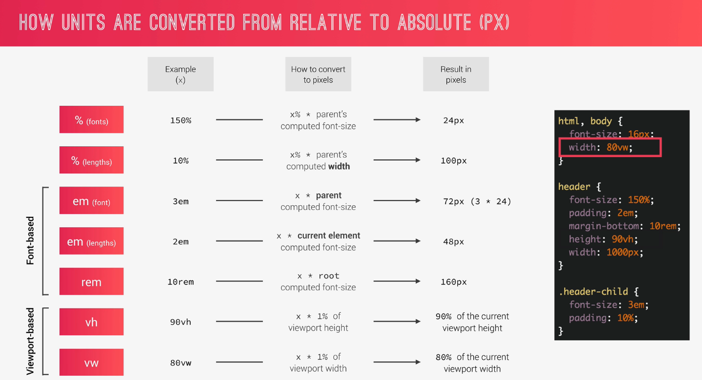

## Notes

- `backface-visibility` :

  - determines if the back part of the element when we transform it is visible or hidden for the user.

  - So imagine we have an element and we rotate it 180 degrees.So it would be logical that we then see the back part of that element, right? But if we use backface-visibility hidden, then that back part behind the element gets hidden.

  - Now in this case (adding to `heading-primary`), we're not rotating anything, we're not doing anything like that but we still use this fix here, like this hack in order to fix this little shaking that we see in the animation. And again, no one really seems to know why the shaking happens and why this fixes it, but as long as it works, it's okay.
     

- `animation-fill-mode` :

  - it will automatically apply the styles up to zero percent before the animation starts So, again, these styles will now be applied before the animation starts simply by using the animation fill mode and set it to backwards.

#### THREE PILLARS TO WRITE GOOD HTML AND CSS... AND BUILD GOOD WEBSITES

#### WHAT HAPPENS TO CSS WHEN WE LOAD UP A WEBPAGE?

#### The C in CSS (CASCADE)

#### CASCADE AND SPECIFICITY: WHAT YOU NEED TO KNOW

- CSS declarations marked with !important have the highest priority;
- But, only use !important as a last resource. It’s better to use correct specificities — more maintainable code!
- Inline styles will always have priority over styles in external stylesheets;
- A selector that contains 1 ID is more specific than one with 1000 classes;
- A selector that contains 1 class is more specific than one with 1000 elements;
- The universal selector \* has no specificity value (0, 0, 0, 0);
- Rely more on specificity than on the order of selectors;
- But, rely on order when using 3rd-party stylesheets — always put your author stylesheet last.

#### CSS Values

#### How units are converted from relative to absolute

#### CSS VALUE PROCESSING:

- Each property has an initial value, used if nothing is declared and if there is no inheritance .
- Browsers specify a root font-si ze for each page (usually 16px);
- Percentages and relative values are always converted to pixels;
- Percentages are measured relative to their **parent's font-size** , if used to specify _font-size_;
- Percentages are measured relative to their parent's wi dth, if used to specify lengths;
- em are measured relative to their parent font-si ze, if used to specify font-si ze;
- em are measured relative to the current font-si ze, if used to specify lengths;
- rem are always measured relative to the document's root font-size;
- vh and vw are simply percentage measurements of the viewport's height and width.
